# Техническое задание на дипломный проект "Веб-приложение онлайн библиотека"

## 1. Введение

Разрабатываемое веб-приложение представляет собой онлайн библиотеку, где пользователи могут покупать, читать и сохранять книги, а администраторы управляют контентом библиотеки. Система предоставляет функционал для взаимодействия как обычных пользователей, так и администраторов.

## 2. Функциональные требования

### 2.1 Функции администратора

- **Добавление книг**: Администратор может добавлять новые книги, заполняя необходимые поля (название, автор, жанр, цена, описание и обложка).
- **Изменение информации о книге**: Возможность редактировать существующие книги (изменение цены, информации о книге, обложки).
- **Удаление книг**: Возможность удаления книг из библиотеки.
- **Установка цен на книги**: Администратор устанавливает цены на книги, которые пользователи могут приобретать.
- **Теги**: Администратор может добавлять, удалять, изменять теги для пользователей.
- **Просмотр платежей**: Просмотр списка покупок пользователей.

### 2.2 Функции пользователя

- **Регистрация и авторизация**: Пользователи должны иметь возможность регистрироваться и авторизовываться в системе.
- **Просмотр книг**: Неавторизованный пользователь может просматривать каталог сайта.
- **Пополнение счета**: Возможность пополнять свой личный счет через интегрированные платежные системы.
- **Покупка книг**: Пользователь может приобретать книги из библиотеки, списывая средства с личного счета.
- **Чтение книг**: Возможность читать купленные книги через встроенный ридер.
- **Сохранение книг в избранное**: Пользователь может добавлять книги в список избранного для быстрого доступа.
- **Комментирование книг**: Возможность оставлять отзывы и комментарии к книгам.
- **Просмотр истории покупок**: Список всех приобретенных книг с датами покупки.
- **Получение тегов**: Пользователи смогут получать теги по достижению каких-либо условий.

## 3. Дополнительные функции

- **Поиск и фильтрация книг**: Полнотекстовый поиск по названиям, авторам и жанрам, а также фильтрация по различным критериям (цена, рейтинг, автор, название книги).
- **Рейтинговая система**: Возможность ставить оценки книгам и сортировать их по рейтингу.
- **Чат с техподдержкой**: Возможность общения с администрацией или техподдержкой по возникающим вопросам.
- **Двухфакторная аутентификация**: Подтвержение входа через Email.

## 4. Средства разработки

- **Backend**: Django (Python)
- **Frontend**: HTML, CSS, JavaScript
- **База данных**: MySQL

## Заключение

Данное приложение должно обеспечить удобный интерфейс для пользователей и администраторов, поддерживать надежные операции с книгами и финансами.

```mermaid
  flowchart TD
    %% Администраторский поток
    Admin[Администратор] -->|Авторизация| AdminPanel[Панель администратора]
    AdminPanel -->|Добавление книг| AddBook[Добавить книгу]
    AdminPanel -->|Изменение информации о книге| EditBook[Редактировать книгу]
    AdminPanel -->|Удаление книг| DeleteBook[Удалить книгу]
    AdminPanel -->|Установка цен| SetPrice[Установить цену]
    AdminPanel -->|Управление тегами| ManageTags[Управлять тегами]
    AdminPanel -->|Просмотр платежей| ViewPayments[Просмотр платежей]

    %% Поток неавторизованного пользователя
    Guest[Неавторизованный пользователь] -->|Просмотр каталога| BrowseCatalog[Просмотр каталога книг]

    %% Пользовательский поток
    User[Пользователь] -->|Регистрация/Авторизация| UserDashboard[Личный кабинет]
    UserDashboard -->|Пополнение счета| TopUp[Пополнить счет]
    UserDashboard -->|Поиск и фильтрация книг| SearchFilter[Поиск и фильтрация]
    UserDashboard -->|Покупка книг| BuyBook[Купить книгу]
    BuyBook -->|Списание средств| DeductBalance[Списание средств]
    UserDashboard -->|Чтение книг| ReadBook[Чтение книги]
    UserDashboard -->|Добавление в избранное| Favorite[Добавить в избранное]
    UserDashboard -->|Комментирование книг| Comment[Оставить комментарий]
    UserDashboard -->|Просмотр истории покупок| PurchaseHistory[История покупок]
    UserDashboard -->|Получение тегов| GetTags[Получить теги]
    UserDashboard -->|Рейтинговая система| Rating[Оценка книги]
    UserDashboard -->|Чат с техподдержкой| SupportChat[Чат с техподдержкой]

    %% Дополнительные связи
    SearchFilter -->|Фильтрация| FilteredBooks[Отфильтрованные книги]
    Favorite -->|Быстрый доступ| FavoriteList[Список избранного]
    PurchaseHistory -->|Список книг| PurchasedBooks[Купленные книги]
    Rating -->|Сортировка по рейтингу| SortedBooks[Отсортированные книги]
```

